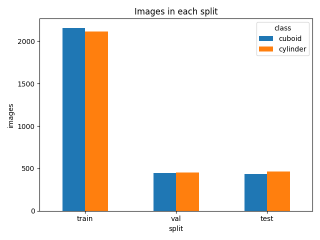
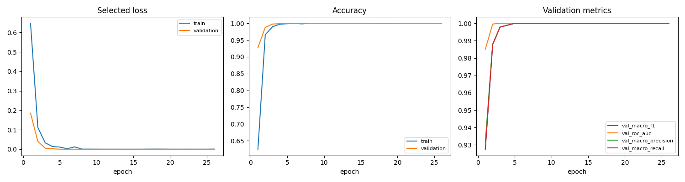
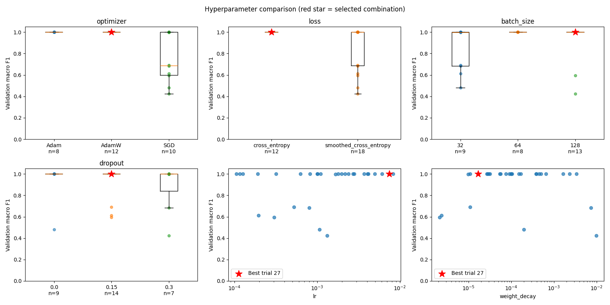
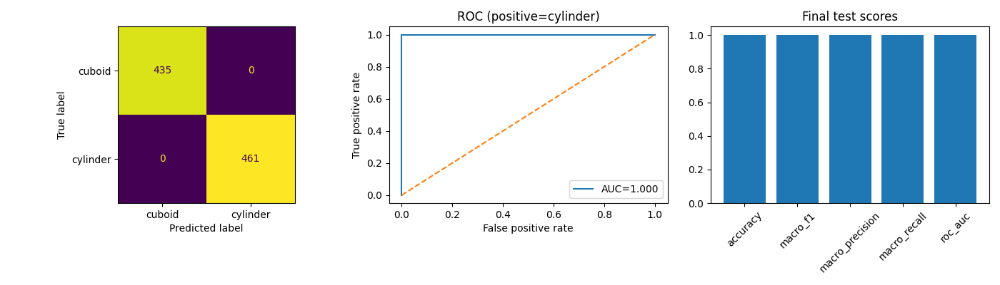

# Shape Pick & Sort Robot

**직접 학습한 CNN으로 도형을 분류하고, 가상 로봇팔이 실제 접촉으로 집어 종류별 상자에 옮기는 개인 프로젝트입니다.**

## 주요 기능

- GUI에서 직육면체·원기둥 개수를 선택해 실행합니다. 합계는 최대 5개입니다.
- 로봇 앞 구역에 크기·위치·회전이 랜덤한 도형을 떨어뜨려 배치합니다.
- 대각선 RGB-D 카메라로 영역과 좌표를 구하고, 선택한 후보의 RGB 사진을 CNN으로 분류합니다.
- Panda 로봇이 역기구학과 실제 손가락 접촉으로 집어 뒤쪽 종류별 상자로 운반합니다.
- 물체 하나를 옮긴 뒤 다시 촬영하며, 가려진 물체도 다시 확인합니다.
- 집기 실패·낙하 시 원인에 따라 복귀·재촬영하고, 추가 재시도는 최대 2회로 제한합니다.
- 제어 창에서 ROS 통신 로그와 로봇 실행 로그를 따로 확인합니다.

**기술:** Python · PyBullet · PyTorch · NumPy · OpenCV · ROS2 Jazzy · Tkinter

## 전체 동작 흐름

```text
GUI에서 도형 선택·시작
    → 장면 생성·물체 정착
    → RGB-D 카메라 촬영
    → 깊이로 객체 후보와 좌표 확인
    → 우선 후보의 RGB crop을 CNN으로 분류·파지 가능 여부 검사
    → 한 물체 집기·종류별 상자로 운반·도착 확인
    → 대기 자세 복귀·재촬영
    → 남은 물체가 없으면 최종 상자 정착 확인
```

후보가 검사에서 탈락하면 같은 촬영의 다음 후보를 확인합니다. 하나가 통과하면 나머지는 분류하지 않고 운반합니다. CNN은 **종류 분류**, 깊이는 **좌표·폭·높이 계산**에 사용합니다.

| ROS2 노드 | 역할 |
|---|---|
| `simulation_node` | 가상세계·촬영·접촉 집기·운반·도착 판정 |
| `perception_node` | 영상 영역 분리·CNN 분류·좌표 추정 |
| `task_manager_node` | 대상 선택·작업 순서·재촬영·재시도 |

노드는 토픽과 서비스로 정보를 주고받습니다. 액션은 현재 사용하지 않습니다.

## CNN 데이터 수집과 Colab 학습

PyBullet에서 사진을 만들고 Colab의 NVIDIA L4 GPU로 학습했습니다. CNN은 깊이를 제외한 **64×64 RGB 사진**으로 직육면체와 원기둥을 구분합니다.

### 1. 사진 수집과 데이터 분할

폭·지름은 3 ~ 6.4cm, 높이는 3 ~ 7cm, Yaw는 −180 ~ 180도로 바꿔 촬영했습니다. 2,000개 장면에서 사진 6,065장을 수집하고, 같은 장면이 서로 다른 분할에 섞이지 않도록 장면 기준 70:15:15로 나눴습니다.

| 분할 | 직육면체 | 원기둥 | 총 사진 |
|---|---:|---:|---:|
| 학습 | 2,157 | 2,113 | 4,270 |
| 검증 | 449 | 450 | 899 |
| 테스트 | 435 | 461 | 896 |



### 2. 작은 CNN으로 여러 설정 학습하기

사전학습 없이 작은 CNN을 학습했습니다. 학습률·옵티마이저·손실함수·배치 크기 등을 랜덤하게 조합해 30가지 설정을 비교했고, 조합마다 최대 30epoch 학습했습니다.



손실이 줄고 학습·검증 정확도가 함께 올라가는지 확인했습니다. 오른쪽 지표들은 1.0에 도달해 선이 겹쳐 보입니다.

### 3. 어떤 설정을 최종 모델로 골랐나?

검증 macro F1을 먼저 비교하고, 같은 점수이면 정답 클래스에 준 확률을 평가하는 NLL이 더 낮은 모델을 선택했습니다. 테스트 사진은 모델 선택에 사용하지 않았습니다.

| 항목 | 최종 설정 |
|---|---|
| 옵티마이저·손실 | AdamW · CrossEntropyLoss |
| 초기 학습률 | 약 0.007415 |
| 배치 크기 | 128 |
| Weight decay·Dropout | 약 0.00001675 · 0.15 |
| 채택한 가중치 | 27번 실험의 20epoch 시점 |
| 검증 F1·NLL | 1.0 · 약 5.70×10⁻⁹ |



빨간 별이 선택한 설정입니다. 30개 중 23개가 F1=1.0이어서 NLL로 최종 모델을 골랐습니다. 여러 설정을 함께 바꿨으므로 한 파라미터만의 효과로 단정하지 않았습니다.

### 4. 선택 후 처음 보는 테스트 사진으로 평가



테스트 896장 모두 올바르게 분류했고, 정확도·macro F1·ROC-AUC는 1.0입니다. **현재 시뮬레이션 데이터의 결과이며, 실제 환경 전체의 정확도나 로봇 집기 성공률을 뜻하지 않습니다.**

### 5. 로컬 추론과 로봇 작업 연결

저장한 모델을 CPU 추론에 연결했습니다. 같은 테스트 896장에서 Colab과 로컬의 예측 종류가 모두 같았고, 기본 크기 혼합 6장면·30개 물체의 분류·운반·최종 정착을 확인했습니다.

[Colab 학습 노트북](notebooks/shape_cnn_colab.ipynb)과 [최종 학습 설정](checkpoints/shape_cnn_v1/best_params.json)은 공개합니다. 사진·가중치·실행 결과는 로컬에서 관리합니다.

## 설치와 실행

Ubuntu 24.04 · Python 3.12 · ROS2 Jazzy 환경에서 검증했습니다. ROS2 Jazzy와 colcon이 설치된 환경에서 프로젝트 루트 기준으로 실행합니다.

### 1. 패키지 설치·ROS2 빌드

```bash
source /opt/ros/jazzy/setup.bash
python3 -m venv --system-site-packages .venv
.venv/bin/python -m pip install -r requirements-sim.txt -r requirements-inference.txt
.venv/bin/python /usr/bin/colcon build --packages-up-to shape_sort_ros --cmake-args -DPython3_EXECUTABLE=/usr/bin/python3
```

Tkinter가 없다면 `sudo apt install python3-tk`로 설치합니다.

### 2. 학습 가중치 준비

학습한 `best_model.pt`를 `checkpoints/shape_cnn_v1/`에 넣습니다. 공개된 `best_params.json`과 **같은 학습 실행에서 나온 가중치**가 필요합니다. 설정 파일만으로는 CNN을 실행할 수 없습니다.

### 3. GUI 실행

```bash
.venv/bin/python scripts/shape_sort_gui.py
```

왼쪽에서 도형 개수를 고르고 **시작**을 누르면 별도 PyBullet 창이 열립니다. 매 실행마다 새로운 랜덤 시드를 사용하며, 실행 중에는 설정을 잠급니다.

오른쪽 위에는 실제 토픽 발행·수신과 서비스 요청·응답, 아래에는 로봇 실행 로그가 표시됩니다. 완료된 장면은 유지하며, **시뮬레이션 종료** 후 다시 시작할 수 있습니다. 제어 창을 닫으면 해당 실행도 정리합니다.

창 크기는 화면에 맞춰 계산합니다. Ubuntu 환경에 따라 창이 겹쳐 뜨면 위치를 옮겨주세요. 관측·로그·결과는 로컬 `outputs/gui-날짜시간/`에 저장합니다.

터미널에서 직접 실행하려면 다음 명령도 사용할 수 있습니다.

```bash
source /opt/ros/jazzy/setup.bash
source install/setup.bash
ros2 launch shape_sort_ros shape_sort.launch.py auto_start:=true
```

## 검증 결과와 현재 한계

- 랜덤 크기 12회와 최소·최대 크기 8회, 총 20회에서 100개 물체의 분류·집기·상자 도착·최종 정착을 확인했습니다. 일부 초기 배치는 조건에 맞지 않아 다음 시드로 재생성됐으며, 모든 랜덤 배치의 성공률은 아닙니다.
- ROS2에서는 혼합 5개 운반과 실제 이동 중 중단을 확인했습니다. GUI에서는 혼합 2개 운반·로그 분리·종료·재실행을 확인했습니다.
- 현재 지원 대상은 직육면체와 수직 원기둥입니다. 기울어진 물체·모든 가림·실제 카메라 환경을 지원하는 단계는 아닙니다.
- 물체를 강제로 붙이거나 이동시키지 않고 접촉으로 집습니다. 이동은 역기구학 기반이며, 실제 로봇 연결·MoveIt·강화학습·마찰에 따른 힘 조절은 아직 구현하지 않았습니다.

빌드 후 자동 검증을 실행하려면 다음 명령을 사용합니다. ROS2 통합 검증은 별도 통신 영역에서 실행합니다.

```bash
source /opt/ros/jazzy/setup.bash
source install/setup.bash
SHAPE_SORT_ROS_INTEGRATION=1 .venv/bin/python -m unittest discover -s tests
```

## 파일 구조

```text
shape-pick-sort-robot/
├── README.md
├── requirements-sim.txt                 시뮬레이션 의존성
├── requirements-inference.txt           CNN 추론 의존성
├── checkpoints/shape_cnn_v1/
│   └── best_params.json                 최종 학습·전처리 설정
├── src/
│   ├── shape_sort_interfaces/           ROS2 메시지·서비스 형식
│   └── shape_sort_ros/                  세 노드·공통 변환·launch·패키지 설정
├── scripts/
│   ├── shape_sort_gui.py                도형 설정·실행·로그 화면
│   ├── multi_object_scene.py            다중 물체 장면·운반·복구
│   ├── contact_grasp_probe.py           공통 로봇 제어·접촉 판정
│   ├── rgbd_camera.py                   깊이 탐지·좌표·파지 기하 계산
│   ├── cnn_inference.py                 모델 복원·RGB 분류
│   ├── collect_cnn_data.py              이미지 수집·데이터 분할
│   └── terminal_ko.py                   한글 로그 표시
├── tests/                              현재 기능의 자동 검증
├── notebooks/shape_cnn_colab.ipynb       CNN 학습·탐색·시각화
└── docs/
    ├── FOLLOW_UP_KO.md                  후속 후보
    └── images/cnn/                     CNN 대표 그래프 4장
```

[후속 후보](docs/FOLLOW_UP_KO.md)에 이후 확장할 내용을 정리했습니다.
